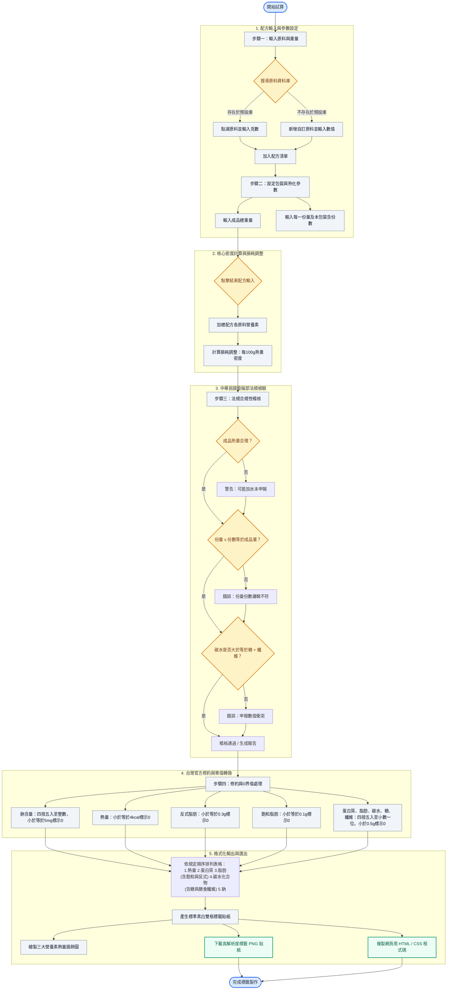

# 營養標示自動試算與合規檢驗儀表板 (Nutrition Label Dashboard)

本專案是一個符合台灣衛福部 (MOHW / FDA) 法規的**包裝食品營養標示自動試算與標籤產生器**。使用者可輸入配方原料克數與成品熟重，系統將會自動進行合規性稽核、計算營養密度，並產生符合台灣標準雙框格式的營養標示貼紙，支援下載為 PNG 圖片與複製 HTML 代碼。

---

## 🔗 系統流程圖 (GitHub 支援自動渲染)

GitHub 會自動將下方的 Mermaid 語法渲染成精美的網頁流程圖：

